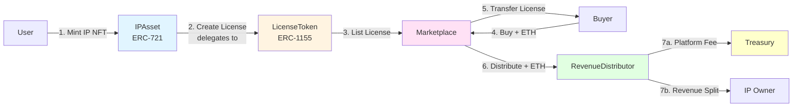
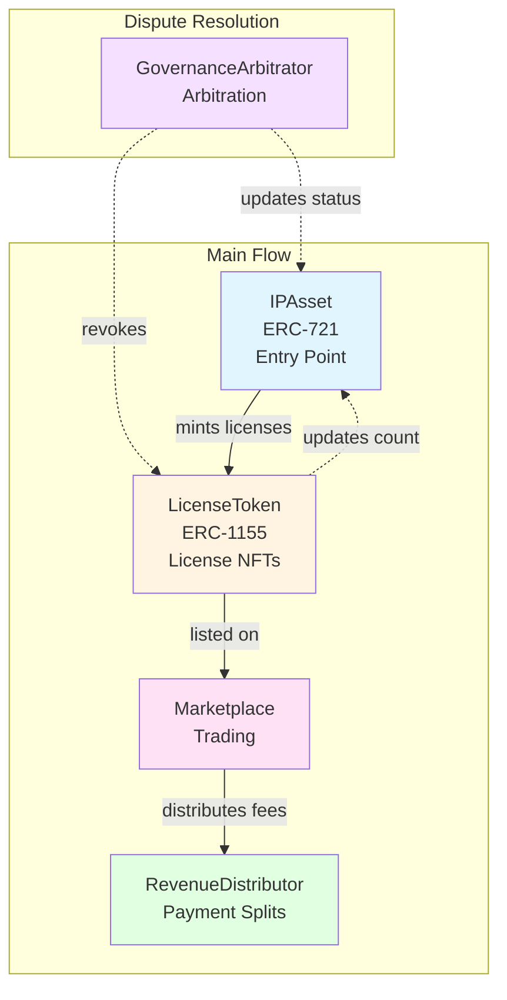
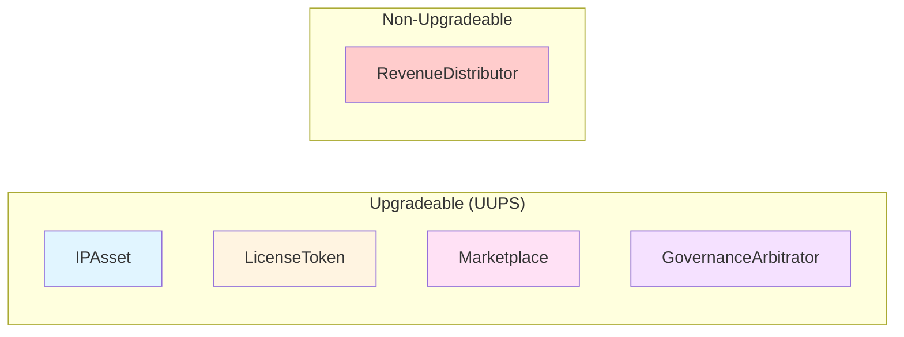

# System Architecture Overview

The Softlaw Marketplace consists of five core smart contracts that work together to enable IP asset trading, licensing, and revenue distribution.

## Contract Flow

The system flow starts with IP asset creation and follows this sequence:

### Key Points

1. **IPAsset is the entry point** - users mint IP assets as ERC-721 NFTs
2. **License creation is delegated** - IPAsset.mintLicense() calls LicenseToken.mintLicense()
3. **Payment flow is automatic** - when a license sells, payment is immediately distributed
4. **Platform fee deducted first** - RevenueDistributor takes fee, then splits remainder

## Contract Architecture

## Contract Relationships

### 1. IPAsset (ERC-721) - Entry Point
**Purpose**: Represents intellectual property ownership

**Key Functions:**
- Mints IP assets as NFTs
- Creates licenses by delegating to LicenseToken
- Tracks active license count for burn protection
- Receives dispute status updates from GovernanceArbitrator

**Flow**: Users start here by minting IP assets, then create licenses to sell.

### 2. LicenseToken (ERC-1155) - License Management
**Purpose**: Semi-fungible license tokens

**Key Functions:**
- Manages license lifecycle (expiry, revocation)
- Controls private metadata access
- Supports one-time and recurring payment licenses
- Updates IPAsset license count

**Flow**: Created by IPAsset, then listed on Marketplace for trading.

### 3. Marketplace - Trading Platform
**Purpose**: Lists and sells licenses

**Key Functions:**
- Lists licenses for sale with fixed prices
- Handles offers with escrow
- Manages recurring payments with penalties
- Distributes sale proceeds via RevenueDistributor

**Flow**: When a license is sold, payment is automatically distributed.

### 4. RevenueDistributor - Payment Distribution
**Purpose**: Splits payments according to configured shares

**Key Functions:**
- Implements EIP-2981 royalty standard
- Configures revenue splits per IP asset
- Handles platform fees (deducted first)
- Manages withdrawals for all recipients

**Flow**: Receives payments from Marketplace sales, distributes to IP owners and collaborators.

### 5. GovernanceArbitrator - Dispute Arbitration
**Purpose**: Third-party arbitration for license disputes with 30-day resolution deadline

**Key Functions:**
- Any party can submit disputes with evidence
- Designated arbitrators resolve disputes within 30 days
- Can revoke licenses when disputes are approved
- Updates IP asset dispute status
- No governance voting - pure arbitration model

**Flow**: Separate from main trading flow, invoked when disputes arise.

## Upgradeability

All contracts except `RevenueDistributor` use **UUPS upgradeable pattern** for future improvements.

## Access Control

All contracts use OpenZeppelin's `AccessControl` for role-based permissions:

**Admin Operations (DEFAULT_ADMIN_ROLE only):**
- Pause/unpause contracts
- Upgrade contracts (UUPS)
- Grant/revoke all roles
- Update contract addresses
- Set penalty rates

**Cross-Contract Roles:**
- **IP_ASSET_ROLE**: Granted to IPAsset → allows minting licenses in LicenseToken
- **LICENSE_MANAGER_ROLE**: Granted to LicenseToken → allows updating license counts in IPAsset
- **ARBITRATOR_ROLE**: Granted to GovernanceArbitrator → allows dispute resolution and revocation
- **MARKETPLACE_ROLE**: Granted to Marketplace → allows auto-revocation for missed payments
- **CONFIGURATOR_ROLE**: Granted to IPAsset → allows configuring revenue splits in RevenueDistributor
