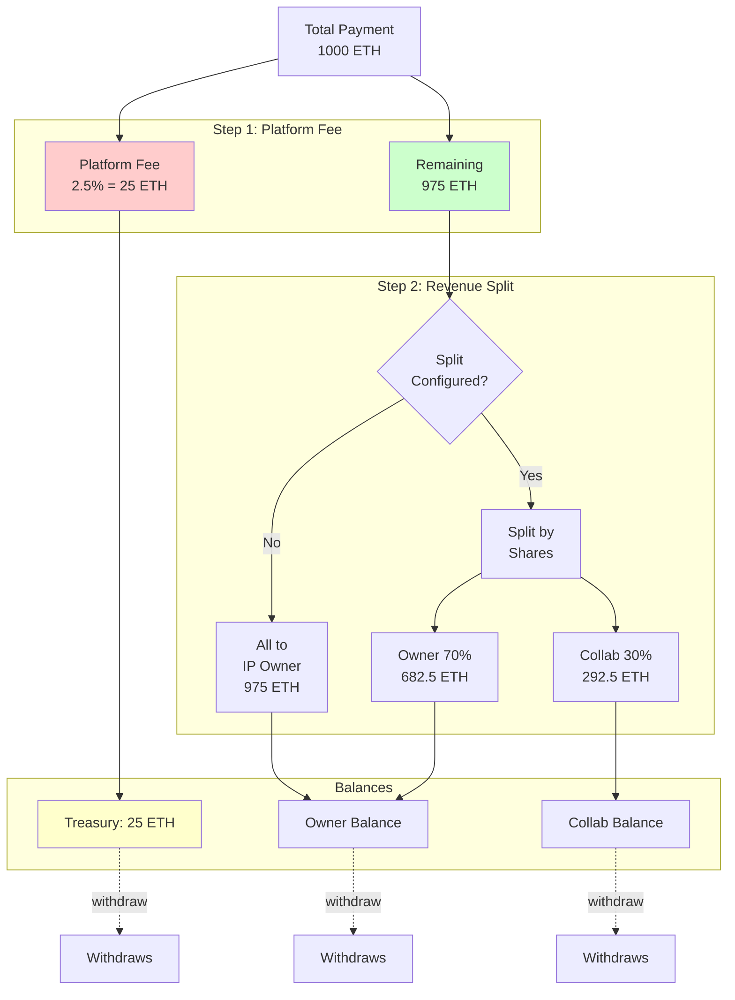
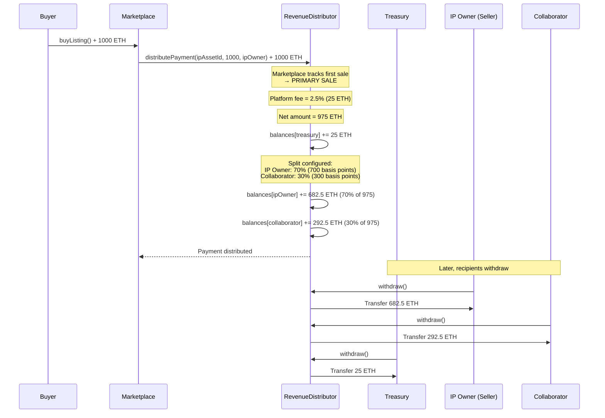
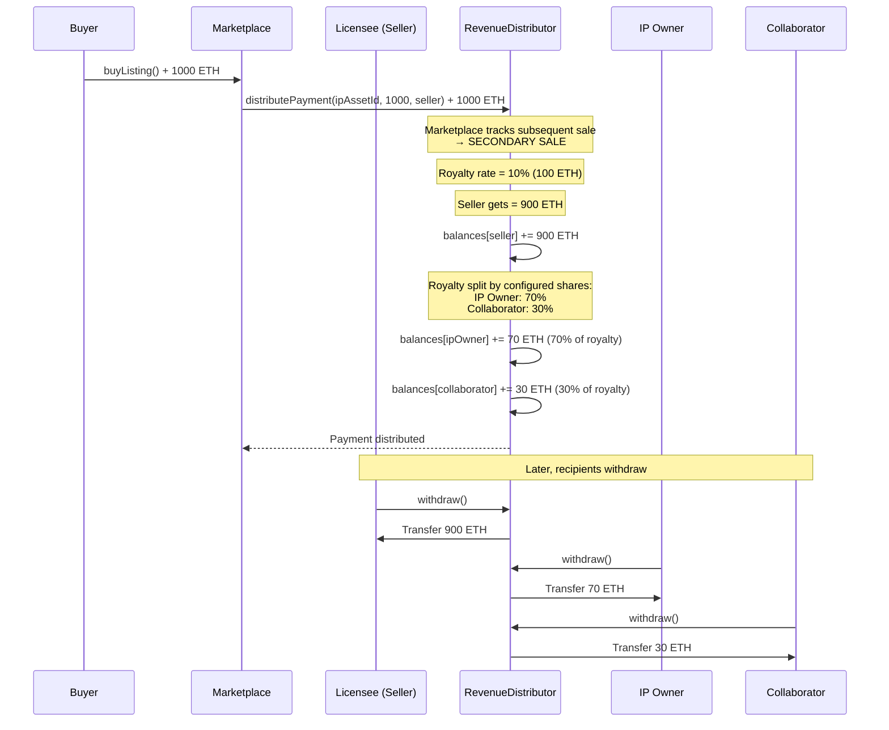
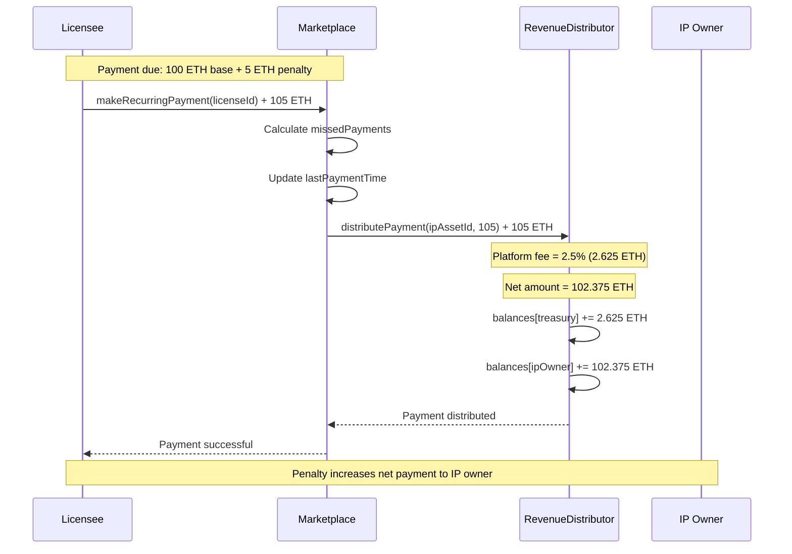
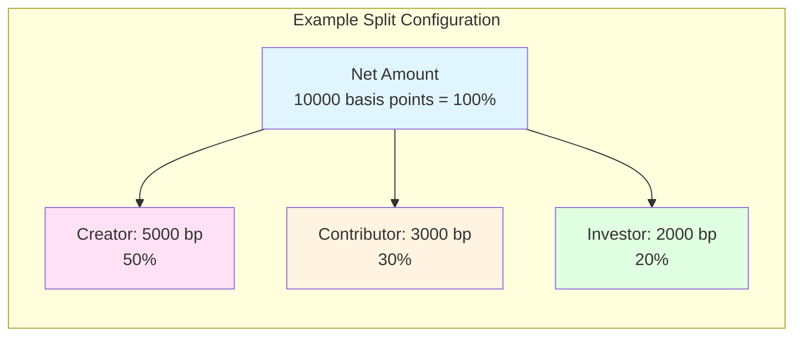
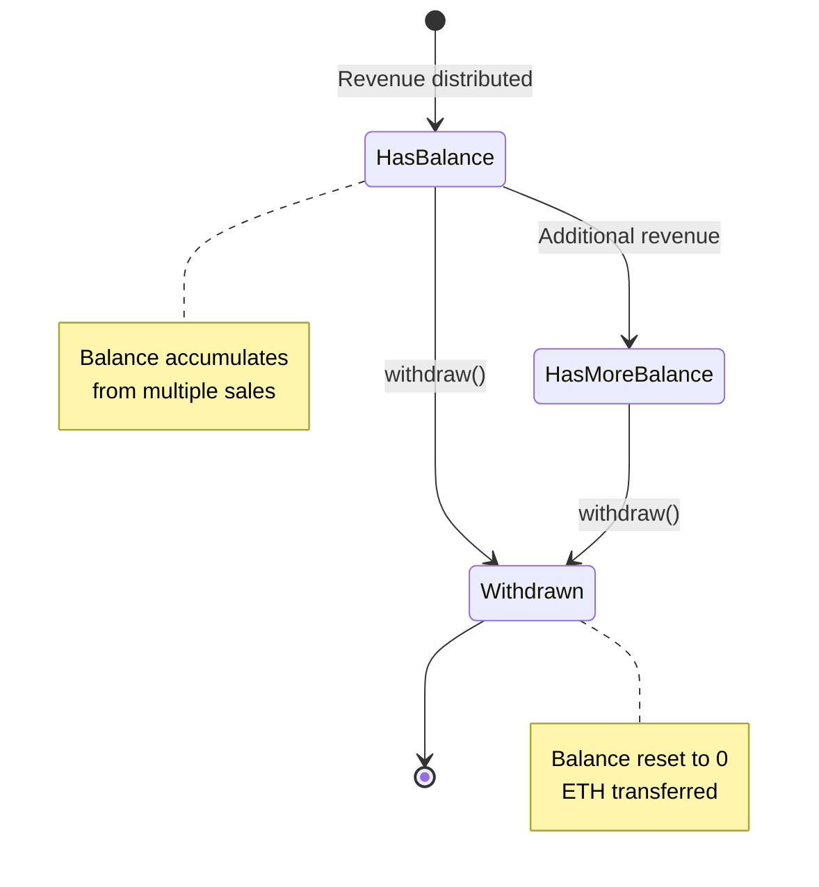

# Revenue Flow

How payments are distributed through the system.

## Primary vs Secondary Sales

**The system automatically detects whether a sale is primary or secondary:**

- **Primary Sale**: First sale of an IP asset or license → Platform fee applies
- **Secondary Sale**: Subsequent sales of the same IP asset or license → Royalty fee applies

## Payment Distribution Overview

RevenueDistributor handles payment splitting differently for primary and secondary sales:

### Distribution Rules

**For Primary Sales** (first sale of an IP asset or license):
1. **Platform fee** is calculated on total amount and deducted first (e.g., 2.5%)
2. **If revenue split configured**, remaining amount split by shares (must sum to 100%)
3. **If no split configured**, all remaining amount goes to IP asset owner

**For Secondary Sales** (subsequent sales):
1. **Royalty fee** is calculated on total amount (default or per-asset custom rate)
2. **Royalty amount** is distributed according to revenue split configuration
3. **Remaining amount** goes to the seller

**General Rules**:
4. **Balances accumulate** until recipient calls withdraw()
5. **Pull-based withdrawals** - recipients control when to withdraw

## Primary Sale Payment Flow

When this is the first sale of an IP asset or license:

## Secondary Sale Payment Flow

When this is a subsequent sale of a previously sold IP asset or license:

## Recurring Payment Flow

## Revenue Split Configuration

Revenue splits are configured per IP asset in basis points (1 basis point = 0.01%).

### Requirements

- All shares must sum to **exactly 10000 basis points** (100%)
- No recipient address can be zero address
- At least one recipient required
- Split can only be configured by IP owner or `CONFIGURATOR_ROLE`

## Royalty Configuration

Royalty rates can be set globally (default) or per IP asset:

**Default Royalty**:
- Applied to all IP assets unless overridden
- Set by admin via `setDefaultRoyalty(basisPoints)`
- Example: 1000 basis points = 10%

**Per-Asset Royalty**:
- Custom royalty for specific IP assets
- Set by CONFIGURATOR_ROLE via `setAssetRoyalty(ipAssetId, basisPoints)`
- Overrides default royalty
- Example: High-value IP might have 1500 bp (15%), while others use default

**Querying Royalty**:
- Use `getAssetRoyalty(ipAssetId)` to get effective rate (custom or default)
- Returns custom rate if set, otherwise returns default rate

## Withdrawal Pattern

All recipients (platform treasury, IP owners, collaborators) use the same withdrawal mechanism:

### Benefits

- Gas efficient (no iterating through recipients)
- Recipients control their own withdrawals
- Supports multiple revenue sources accumulating
- No risk of failed transfers blocking other recipients
