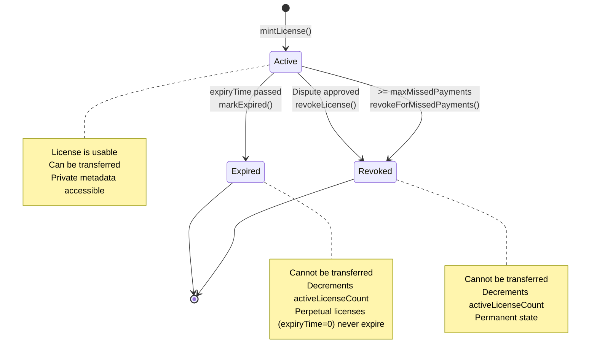
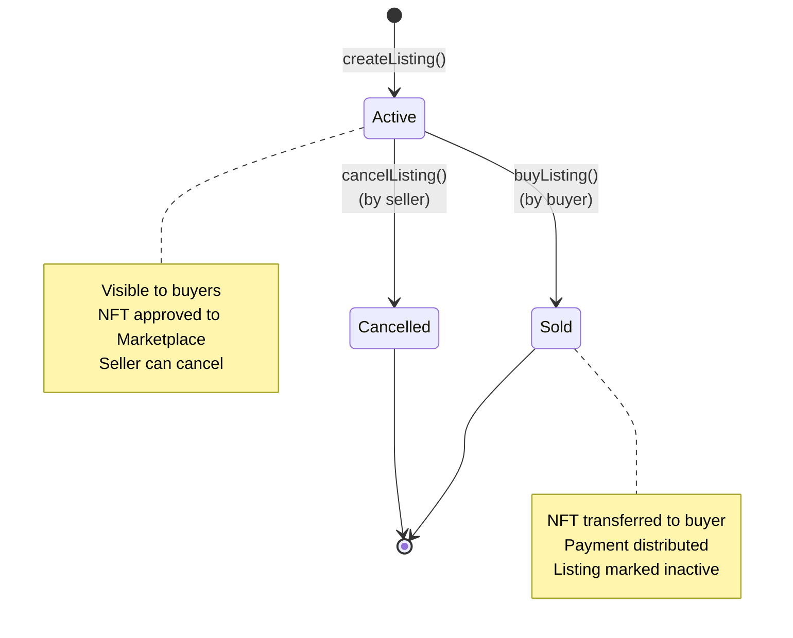
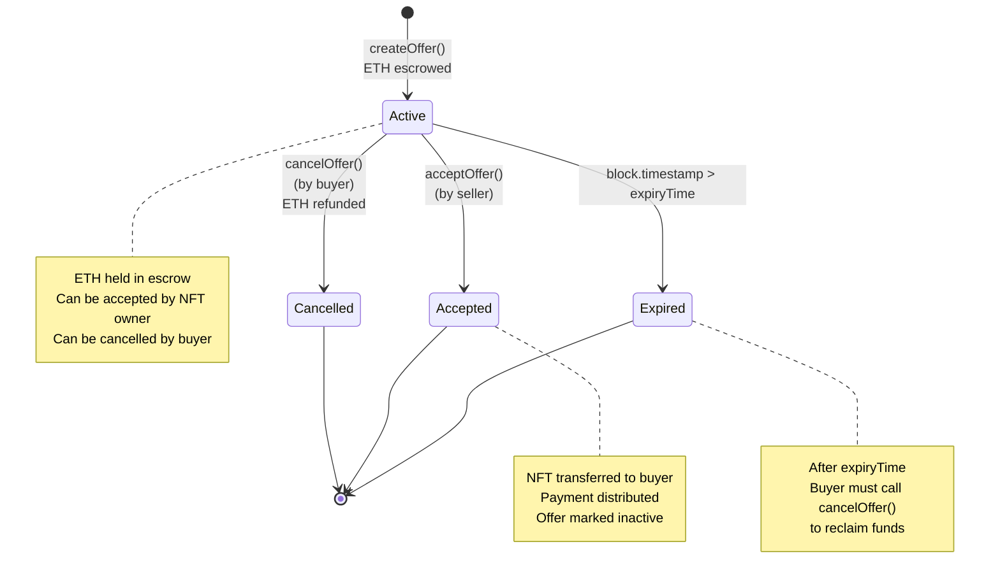
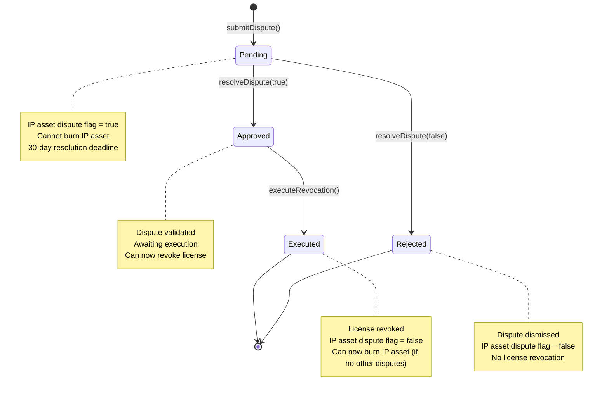
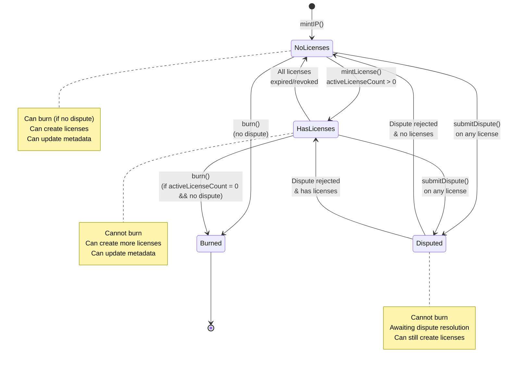
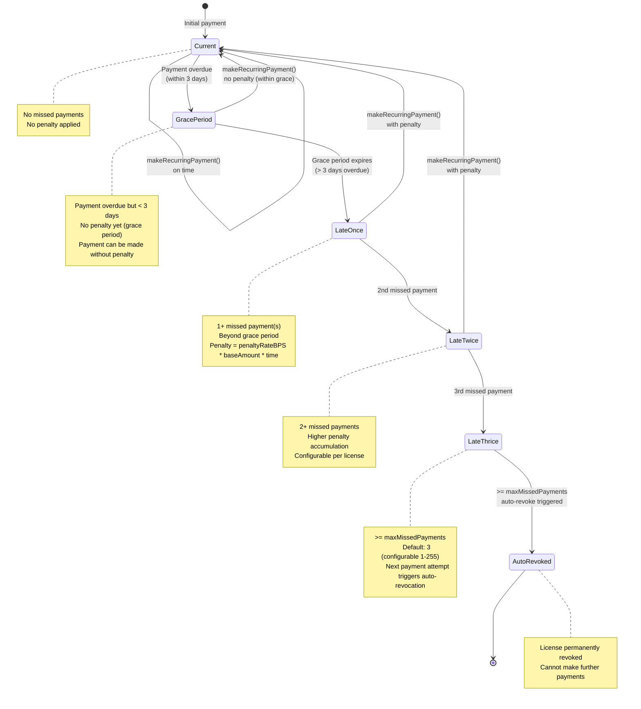
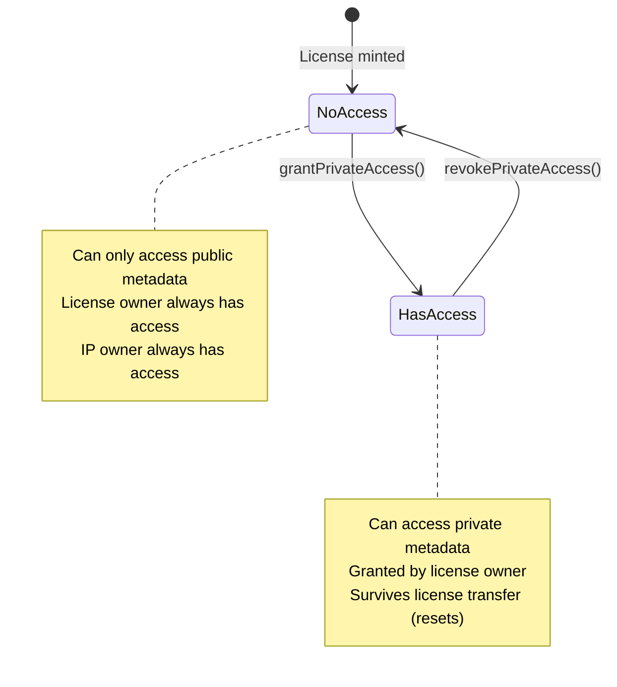

# State Machines

Lifecycle and state transitions for key entities in the system.

## License Lifecycle

## Marketplace Listing

## Marketplace Offer

## Dispute Status

## IP Asset Lifecycle

## Recurring Payment Status

### Configurable Payment Parameters

Each license has configurable payment parameters:

**maxMissedPayments** (defaults to 3):
- Range: 1-255
- Determines when auto-revocation occurs
- Can be set per license at mint time
- 0 = uses DEFAULT_MAX_MISSED_PAYMENTS (3)

**penaltyRateBPS** (defaults to 500 = 5%):
- Range: 0-5000 basis points (0-50%)
- Applied per month, calculated pro-rata
- Can be set per license at mint time
- 0 = uses DEFAULT_PENALTY_RATE (500)

**PENALTY_GRACE_PERIOD** (fixed at 3 days):
- Global constant across all licenses
- No penalties accrue during grace period
- After due date + 3 days, penalties start
- Gives licensees time to make payment without penalty

## Access Control States

