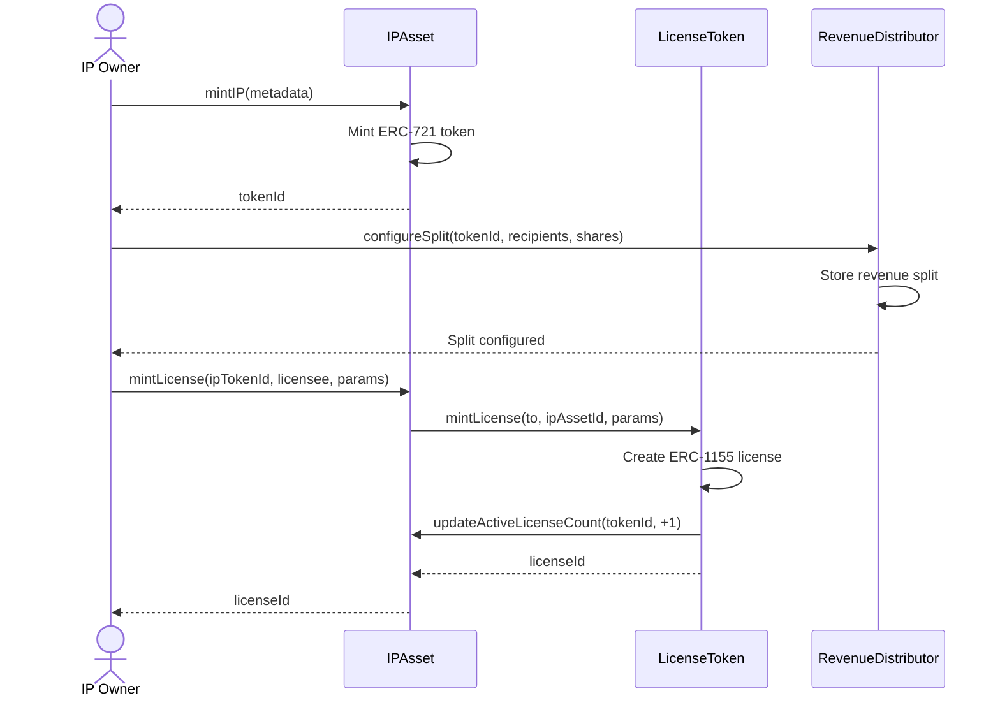
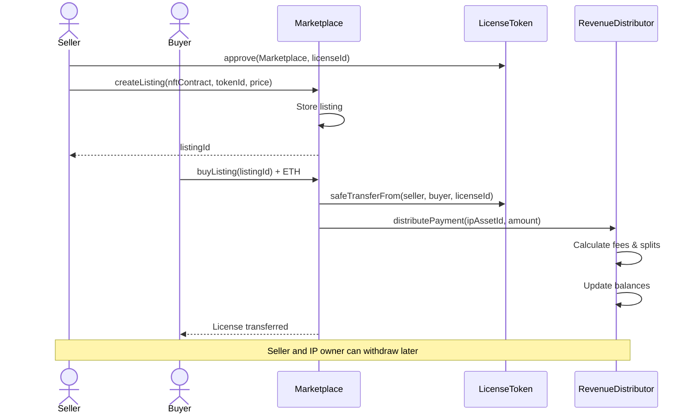
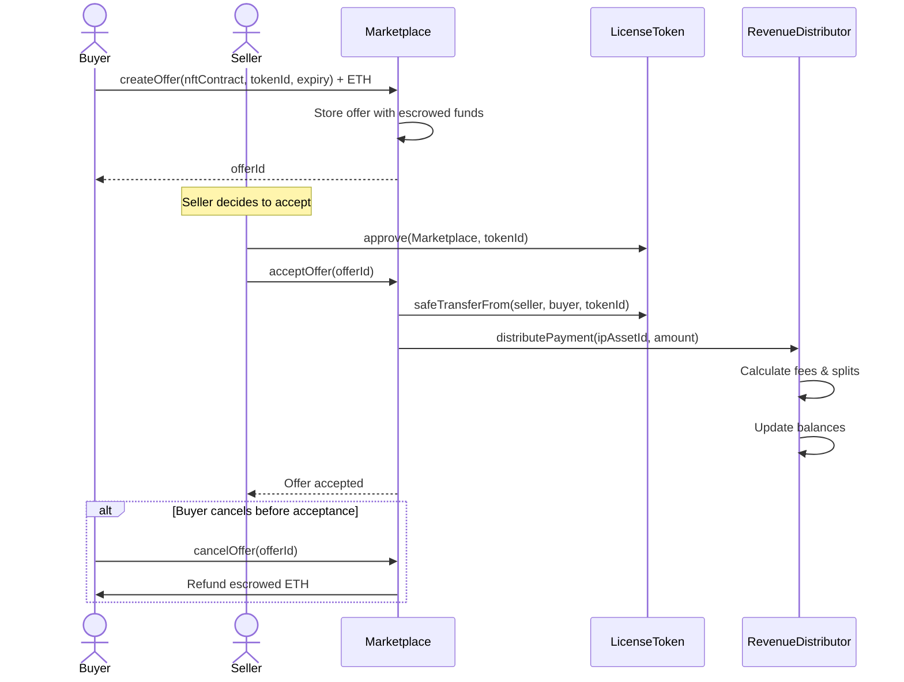
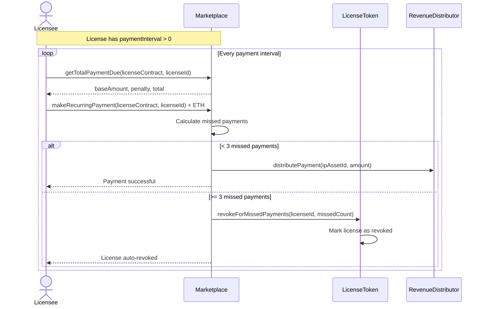
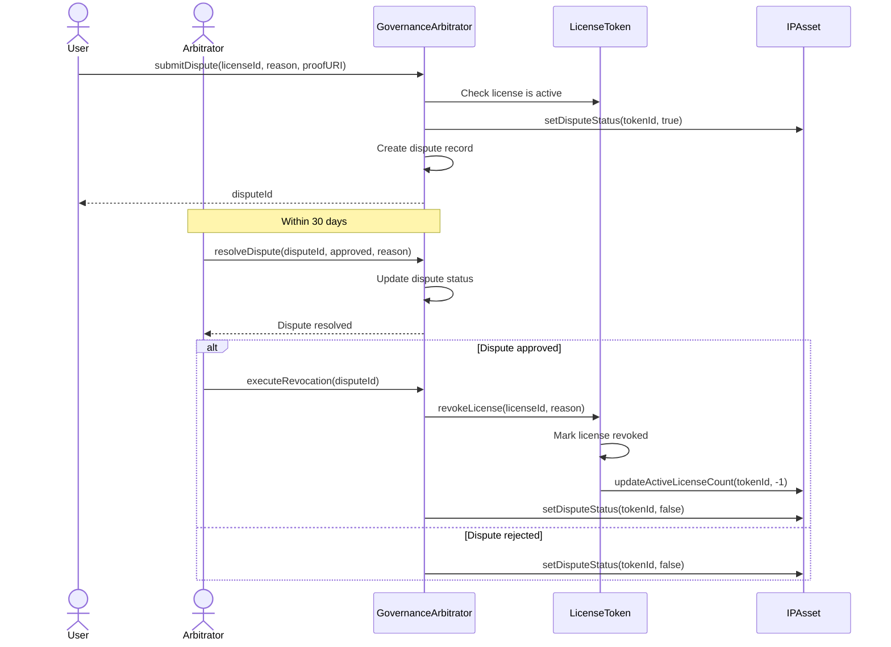
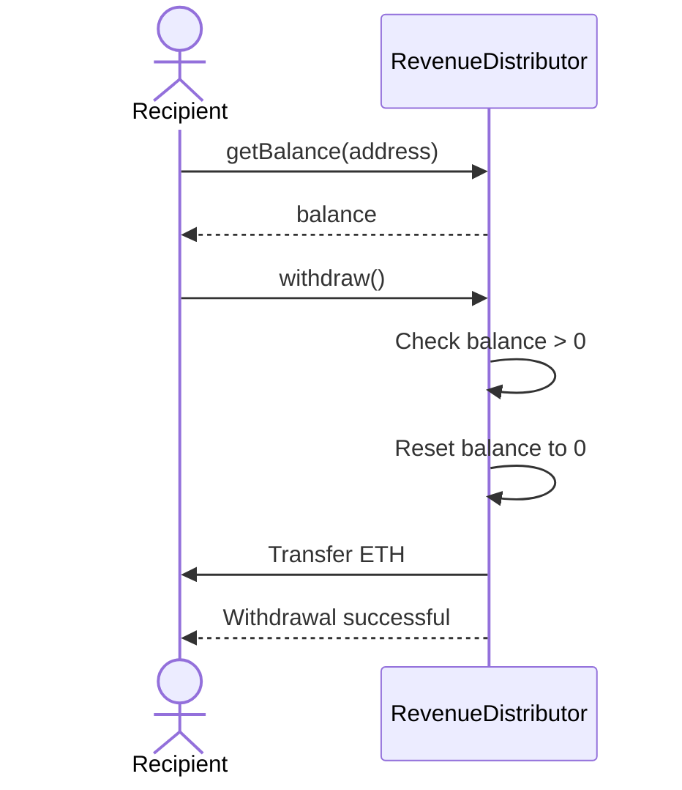

# User Flows

Key user journeys through the Softlaw Marketplace system.

## Creating and Licensing IP

## Buying a Listed License

## Making an Offer

## Recurring Payments (Subscription Licenses)

## Dispute Resolution

## Revenue Withdrawal

